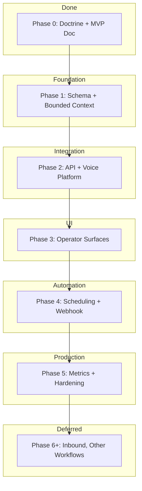

# Voice Assistant — Full Phase Plan

**Purpose:** Phase-by-phase implementation plan for Voice Assistant. All phases serve one workflow: **proposal follow-up (outbound)**. No expansion until Phase 1 proves value.

See [VOICE_ASSISTANT_PHASE_1_MVP.md](VOICE_ASSISTANT_PHASE_1_MVP.md) for scope, trigger, outcomes, and UI.

---

## Overview

---

## Phase 0 — Done

- Doctrine docs (BUSINESS_ALIGNMENT_GATE, PROACTIVE_PERSISTENT_SELF_IMPROVING, SELF_LEARNING_SKILL_DOCTRINE, IDEA_ROADMAP)
- [VOICE_ASSISTANT_PHASE_1_MVP.md](VOICE_ASSISTANT_PHASE_1_MVP.md) with locked workflow, trigger, outcomes, UI scope
- Reliability gate: PHASE_8_GO_NO_GO passed

---

## Phase 1 — Foundation (Schema + Bounded Context)

**Goal:** Declare domain, add schema, no voice platform yet.

### 1.1 Bounded Context

- Add Voice as context 10 to [BOUNDED_CONTEXTS.md](BOUNDED_CONTEXTS.md)

### 1.2 Schema

- **VoiceCallLog** — proposalId, leadId, contactPhone, outcome (enum: booked_callback | requested_manual_followup | not_interested | no_answer | opted_out), calledAt, durationSeconds, externalCallId (Retell/Vapi), meta (transcript snippet, notes)
- **Consent/Opt-out** — Add to Lead and/or Proposal: `voiceConsentAt DateTime?`, `voiceOptedOutAt DateTime?` (or single `VoiceConsent` model with leadId/proposalId, consentedAt, optedOutAt)

### 1.3 Migration

- `prisma migrate dev` for new models/fields

### 1.4 Service Shell

- `src/lib/voice/` — `getEligibleProposals()`, `logCallOutcome()`, `checkConsent()`, `recordOptOut()`

**Exit criteria:** Schema exists, service can query eligible proposals (trigger logic), no API routes yet.

---

## Phase 2 — API + Voice Platform Integration

**Goal:** API contracts and Retell/Vapi wiring. No UI yet.

### 2.1 Stack Choice

- Decide Retell vs Vapi; add env vars (e.g. `VAPI_API_KEY` or `RETELL_API_KEY`)

### 2.2 API Routes

- `GET /api/voice/eligible` — list proposals matching trigger (auth)
- `POST /api/voice/schedule-follow-up` — body: `{ proposalId }`; validates consent, triggers voice platform outbound
- `POST /api/voice/webhook` — receives outcome from Retell/Vapi; idempotent by externalCallId; writes VoiceCallLog
- `PATCH /api/proposals/[id]` or dedicated route — set `voiceConsentAt` (consent toggle)
- `POST /api/voice/opt-out` — body: `{ proposalId }`; sets optedOutAt

### 2.3 Voice Platform

- Create assistant in Retell/Vapi with proposal follow-up script (versioned)
- Configure webhook URL to `POST /api/voice/webhook`
- Client Engine provides: proposal context, contact info, consent state via API call from voice platform (or pre-loaded)

### 2.4 Contract Tests

- 401, 200 shape, 500 sanitized for new routes per [API_CONTRACTS.md](API_CONTRACTS.md)

**Exit criteria:** Manual trigger (curl) can schedule a call; webhook receives and logs outcome.

---

## Phase 3 — UI Surfaces

**Goal:** Operator can see eligible proposals, set consent, trigger calls, view outcomes.

### 3.1 Proposal Follow-ups Page

- Add "Eligible for voice" bucket to `src/app/dashboard/proposal-followups/page.tsx`
- Query: `GET /api/proposals/followups?bucket=voice_eligible` or extend existing followups API
- Consent toggle per row
- "Schedule voice call" button → `POST /api/voice/schedule-follow-up`

### 3.2 Lead/Proposal Detail

- Consent toggle on proposal detail (or lead Sales tab)
- Display last voice call + outcome

### 3.3 Command Center

- Voice follow-ups card: eligible count, primary metric (% booked_callback or requested_manual_followup)
- Reuse pattern from `CadenceDueCard`, `FollowUpQueueCard`

### 3.4 Call Log

- New page `/dashboard/voice/calls` or section on proposal-followups: list VoiceCallLog with proposal, outcome, date

**Exit criteria:** Operator can consent, schedule, and see outcomes from the UI.

---

## Phase 4 — Scheduling + Automation

**Goal:** Cron or job can auto-schedule eligible calls; no manual trigger required for daily batch.

### 4.1 Job/Cron

- `processVoiceFollowUps()` — fetches eligible, respects calling window, rate limit (e.g. max N/day)
- `POST /api/voice/process` — cron or job-schedule; Bearer AGENT_CRON_SECRET
- Or extend existing job-schedules with new cadence type

### 4.2 Calling Window

- Config: allowed hours (e.g. 9–18), timezone, days (Mon–Fri)
- Skip if outside window

### 4.3 Rate Limit

- Max calls per day (e.g. 10) to avoid platform cost spike; configurable

**Exit criteria:** Cron runs; eligible proposals get calls scheduled within window and limits.

---

## Phase 5 — Metrics + Hardening

**Goal:** Primary metric visible, degraded states, contract tests, docs.

### 5.1 Primary Metric

- Compute: % of calls → booked_callback | requested_manual_followup
- Expose via `GET /api/voice/metrics` or extend command-center data
- Display on Command Center voice card

### 5.2 Degraded Mode

- If voice platform unreachable or webhook fails: log ops event, set degraded, show banner per [CLIENT_ENGINE_POWER_OF_10.md](CLIENT_ENGINE_POWER_OF_10.md) Law 3

### 5.3 Contract Tests

- Full coverage for `/api/voice/*` per API_CONTRACTS

### 5.4 Docs

- Update ROADMAP, CHANGELOG; session journal; run `npm run docs:generate`

**Exit criteria:** Metrics visible, degraded handled, tests pass, docs updated.

---

## Phase 6+ — Deferred (After Phase 1 Proves Value)

| Phase | Workflow | Trigger |
|-------|----------|---------|
| 6a | Overdue follow-up (Acquire) | Deal stale, no touch |
| 6b | Booking/reminder (Retain) | Appointment upcoming |
| 6c | Inbound routing | Incoming call |

Each requires: new trigger definition, new script, new UI surfaces. Do not start until proposal follow-up shows clear ROI.

---

## Dependencies

| Phase | Depends On |
|-------|------------|
| 1 | Phase 0 done, PHASE_8_GO_NO_GO green |
| 2 | Phase 1, stack choice (Retell/Vapi) |
| 3 | Phase 2 |
| 4 | Phase 3 |
| 5 | Phase 4 |

---

## File Summary

| Phase | New/Modified Files |
|-------|--------------------|
| 1 | BOUNDED_CONTEXTS.md, prisma/schema.prisma, src/lib/voice/*.ts |
| 2 | src/app/api/voice/**/*.ts, .env.example (voice keys) |
| 3 | proposal-followups/page.tsx, proposals/[id]/page.tsx, CommandSection2.tsx, VoiceCallsCard, /dashboard/voice/calls |
| 4 | src/lib/voice/process.ts, POST /api/voice/process, job-schedules |
| 5 | GET /api/voice/metrics, DegradedBanner for voice, contract tests |

---

## See Also

- [VOICE_ASSISTANT_PHASE_1_MVP.md](VOICE_ASSISTANT_PHASE_1_MVP.md) — scope, trigger, outcomes, UI
- [IDEA_ROADMAP.md](IDEA_ROADMAP.md) — Active/Incubator/Kill map
- [BOUNDED_CONTEXTS.md](BOUNDED_CONTEXTS.md) — domain ownership
